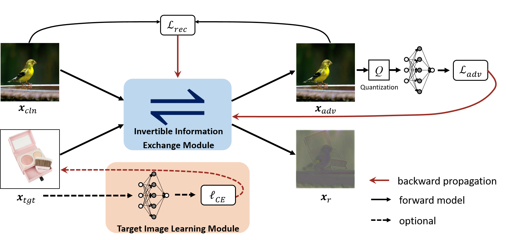
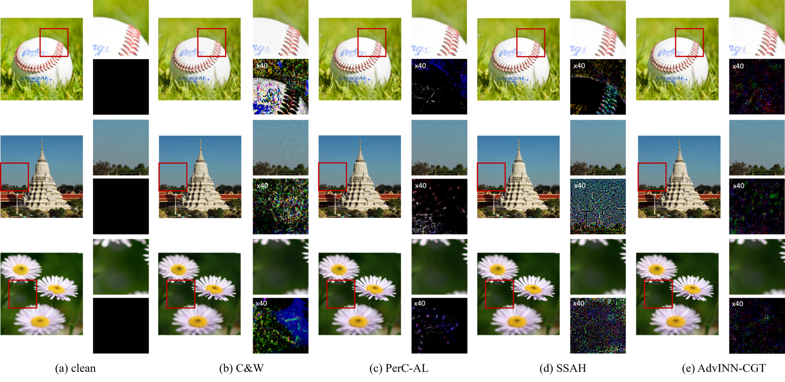

# Imperceptible Adversarial Attack via Invertible Neural Networks
We provide code and our dataset for the Paper:

<!--!**[Imperceptible Adversarial Attack via Invertible Neural Networks](#)**\-->
Zihan Chen, Ziyue Wang, Jun-Jie Huang, Wentao Zhao, Xiao Liu, and Dejian Guan\
[AAAI 2023]




## Abstract
Adding perturbations via utilizing auxiliary gradient information or discarding existing details of the benign images are two common approaches for generating adversarial examples. Though visual imperceptibility is the desired property of adversarial examples, conventional adversarial attacks still generate traceable adversarial perturbations. In this paper, we introduce a novel Adversarial Attack via Invertible Neural Networks (AdvINN) method to produce robust and imperceptible adversarial examples. Specifically, AdvINN fully takes advantage of the information preservation property of Invertible Neural Networks and thereby generates adversarial examples by simultaneously adding class-specific semantic information of the target class and dropping discriminant information of the original class. Extensive experiments on CIFAR-10, CIFAR-100, and ImageNet-1K demonstrate that the proposed AdvINN method can produce less imperceptible adversarial images than the state-of-the-art methods and AdvINN yields more robust adversarial examples with high confidence compared to other adversarial attacks.




## Requisites

* PyTorch
  Use the instructions that are outlined on [PyTorch Homepage](http://pytorch.org/docs/master) for installing PyTorch for your operating system
* Python 3
* NVIDIA GPU + CUDA CuDNN


### Train

- ### Prepare data

Download and unzip our [dataset](https://drive.google.com/file/d/1HHLxXVuCYNdiaXoWH3gyDvCbJSM3rWKi/view?usp=sharing) which is randomly selected from ImageNet-1K, and then copy their path to ```args/inputpath```. You are also freely to run AdvINN on your dataset.

- ### Run

You can run ```train.py``` directly.

## Description of the files in this repository

1) ``train.py``: Execute this file to train the model 
2) ``args.py``: Image and model parameters setting 
3) ``config.py``: Hyperparameters setting
4) ``model/``: Architecture of Invertible Neural Networks
5) ``modules/``: Architecture of ACBs
6) ``pretrained/``: Pre-trained model parameters

## Acknowledgement

Our code architecture  is inspired by [DeepMIH](https://github.com/TomTomTommi/DeepMIH).


## Citation

If you find this code and data useful, please consider citing the original work by authors:

```
```

Feel free to contact: chenzihan21@nudt.edu.cn
